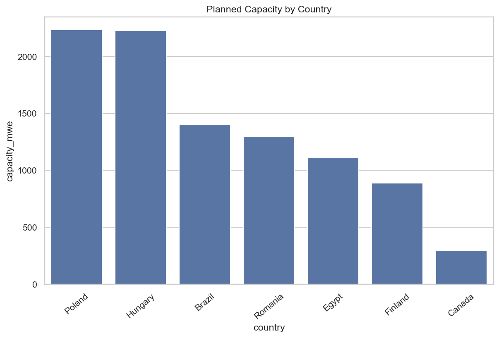
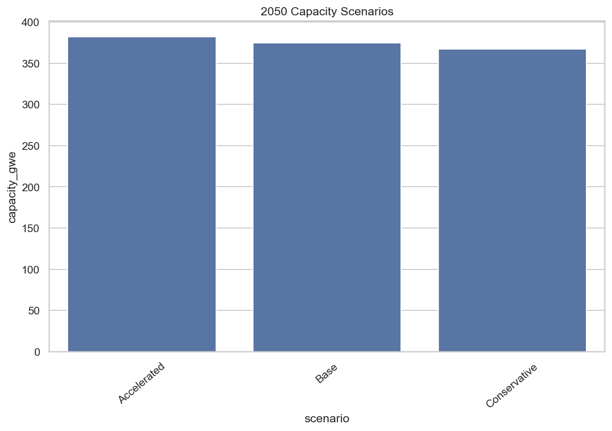
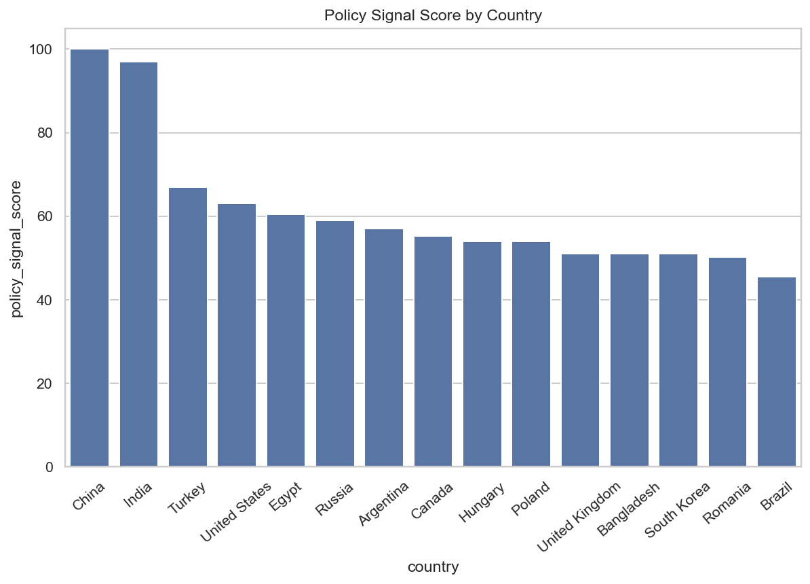

# Global Nuclear Buildout Intelligence

AI-driven nuclear energy intelligence platform for forecasting reactor deployment, analyzing global buildout trends, and supporting strategic energy insights.

## Executive Summary

This project is an end-to-end analytics platform for nuclear energy strategy. It combines public and sample reactor datasets, country-level context, machine learning, scenario modeling, NLP-style policy signals, SQL outputs, and a Streamlit dashboard to analyze nuclear capacity, project pipelines, technology maturity, and deployment risk.

The repository is designed as a realistic consulting-style data product: transparent assumptions, reproducible pipeline steps, clear outputs, and business-facing reporting.

## Objective

Build a structured intelligence platform that helps answer practical questions about nuclear energy deployment:

- Which countries have the strongest operating and planned nuclear capacity?
- How are reactor technologies distributed across regions and project stages?
- Which project pipelines appear higher risk based on transparent scoring rules?
- How could different buildout assumptions affect future capacity and electricity generation?
- How can fragmented public energy data be transformed into decision-ready outputs?

## Problem Statement

Nuclear project data is fragmented across technical databases, country reports, policy documents, and industry publications. Strategic users need a clean way to compare projects, technologies, countries, and scenarios without overstating uncertainty.

This platform addresses that problem by standardizing the data workflow, documenting assumptions, creating analytical features, and presenting outputs through dashboards, reports, and exportable tables.

## Data Sources

The project supports multiple public nuclear and energy data sources, with sample data included so the pipeline can run without private files.

- IAEA PRIS-style reactor data
- IAEA RDS-1-style capacity projection templates
- IAEA ARIS / SMR catalogue-style advanced reactor information
- World Nuclear Association-style country and project information
- Global Energy Monitor-style facility tracking
- Our World in Data energy data
- World Bank country indicators
- Labeled sample data for reproducible demonstration

The included sample data is used for demonstration and methodology validation. It should not be treated as a live official dataset.

## Features

- Reactor fleet and project pipeline analytics
- Nuclear capacity forecasting with machine learning and time-series models
- Project realization and delay-risk scoring
- Technology maturity scoring for reactor families
- Country clustering using KMeans and PCA
- Policy and technology signal extraction from text
- Electricity generation scenarios under configurable assumptions
- SQL analytical layer for reusable queries
- Streamlit dashboard with multi-page analysis views
- Power BI-ready export structure
- Executive reports, model cards, methodology notes, and data dictionaries
- PySpark / Databricks templates for scale-out ETL patterns

## Tech Stack

- Python
- pandas, numpy
- scikit-learn
- XGBoost
- statsmodels
- NLTK
- matplotlib, seaborn, Plotly
- Streamlit
- SQLite
- pytest
- PySpark / Databricks templates

## Project Structure

```text
global-nuclear-buildout-intelligence/
├── data/                 # raw, sample, and processed analytical datasets
├── docs/                 # methodology, architecture, model card, data dictionary
├── models/               # serialized model artifacts
├── notebooks/            # exploratory analysis and modeling notebooks
├── outputs/              # figures, reports, metrics, predictions, SQL results
├── powerbi/              # Power BI schema and export documentation
├── spark/                # PySpark and Databricks templates
├── sql/                  # table creation and analytical queries
├── src/                  # ingestion, features, models, NLP, reports, dashboard
├── tests/                # pytest coverage for core pipeline behavior
├── run_pipeline.py       # end-to-end pipeline entry point
└── README.md
```

## Methodology

The workflow follows a reproducible data-product pattern:

1. Ingest or generate reactor, country, technology, policy, and energy datasets.
2. Clean and standardize raw fields into consistent analytical tables.
3. Engineer project, country, technology, scenario, and policy features.
4. Train or apply forecasting, classification, clustering, and scoring models.
5. Evaluate model outputs and record metrics where appropriate.
6. Generate figures, reports, SQL exports, predictions, and dashboard-ready tables.
7. Present results through Streamlit and structured documentation.

Risk, maturity, and scenario outputs are intentionally transparent. Where real historical labels are not available, the repository documents heuristic assumptions rather than presenting them as ground truth.

## Results / Insights

The repository produces local outputs after running the pipeline, including:

- reactor fleet summaries by country, region, technology, and project status
- capacity forecast tables and visualizations
- project risk and realization probability outputs
- country strategy clusters
- technology maturity rankings
- electricity generation scenario outputs
- data quality and source coverage reports
- executive markdown reports for non-technical review

For current generated artifacts, see:

- `outputs/reports/global_nuclear_buildout_report.md`
- `outputs/reports/executive_summary.md`
- `outputs/metrics/`
- `outputs/predictions/`
- `outputs/figures/`

## Screenshots

Representative generated figures:







Dashboard screenshots will be added soon.

## How to Run Locally

```bash
git clone https://github.com/gastonecisterna405/global-nuclear-buildout-intelligence.git
cd global-nuclear-buildout-intelligence

python -m venv .venv
source .venv/bin/activate
pip install -r requirements.txt

python run_pipeline.py
streamlit run src/dashboard/app.py
```

Run tests with:

```bash
pytest
```

## Future Improvements

- Replace sample data with regularly refreshed official source exports.
- Add stronger historical project completion labels for supervised risk modeling.
- Add weather, market, policy, and financing indicators where reliable sources are available.
- Track model experiments and data versions with a formal MLOps tool.
- Add dashboard screenshots and deployment documentation.
- Expand Power BI and Databricks workflows for enterprise-style delivery.

## Professional Note

This project reflects my target work at the intersection of nuclear engineering, data science, simulation, forecasting, and strategic decision support for energy and industrial systems.

## License

MIT
